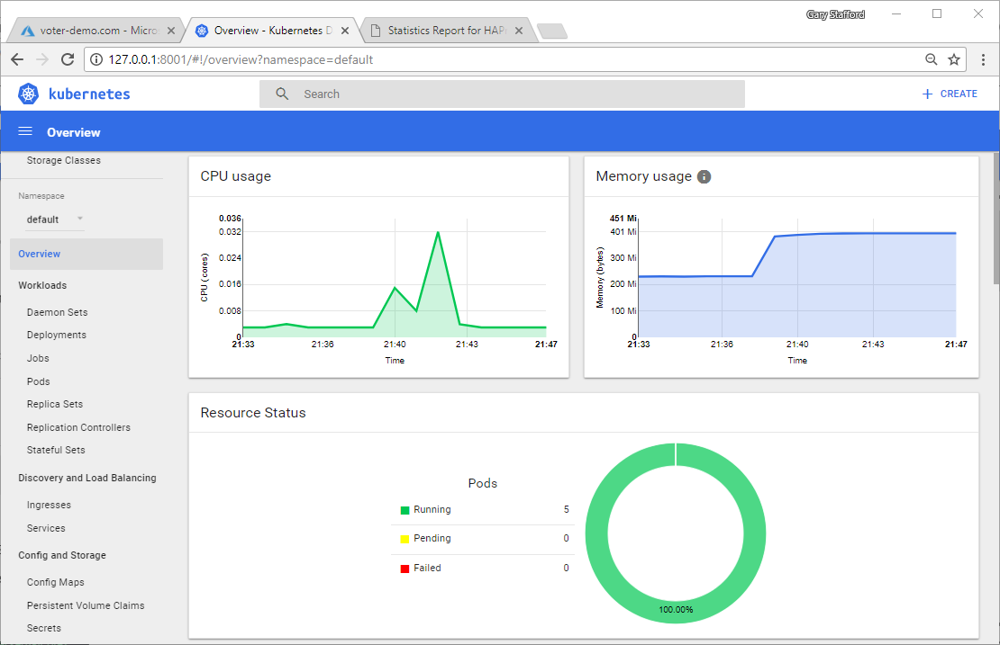
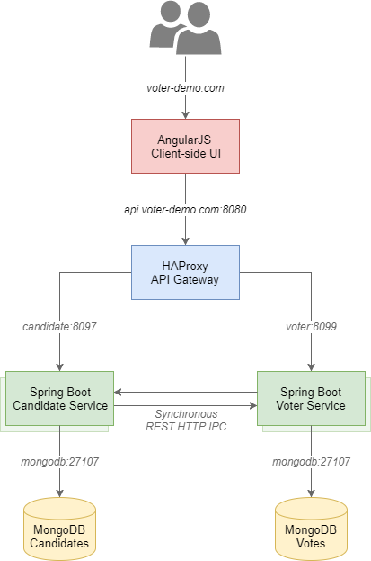

# Azure AKS Demo Project

Project repository for the my blog post, [First Impressions of AKS, Azure’s New Managed Kubernetes Container Service](https://wp.me/p1RD28-5D3).

An simple, multi-tier web application, which I had used in several previous posts, including Eventual Consistency: [Decoupling Microservices with Spring AMQP and RabbitMQ](https://wp.me/p1RD28-4bq). This application, the Voter application, is composed of an AngularJS frontend UI, and two Spring Boot microservices, both backed by individual MongoDB databases, and fronted with an HAProxy-based API Gateway. The AngularJS UI calls the API Gateway, which in turn calls the services. The two microservices communicate with each other via HTTP-based inter-process communication (IPC).

